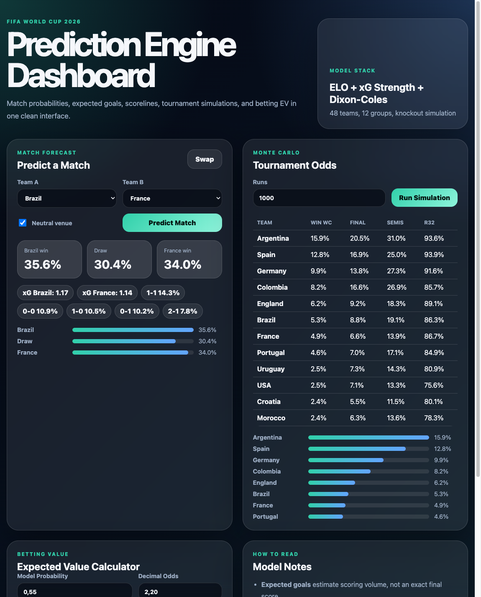
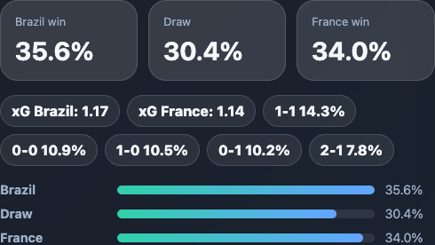

# FIFA World Cup 2026 Prediction Engine

Production-ready Python prediction engine for FIFA World Cup 2026 match forecasts, tournament simulation, LLM reasoning prompts, and betting expected value analysis.

## Choose Language

<p>
  <a href="docs/README_10_LANGUAGES.md#1-فارسی"><kbd>Persian / فارسی</kbd></a>
  <a href="docs/README_10_LANGUAGES.md#2-العربية"><kbd>Arabic / العربية</kbd></a>
  <a href="docs/README_10_LANGUAGES.md#3-español"><kbd>Spanish / Español</kbd></a>
  <a href="docs/README_10_LANGUAGES.md#4-français"><kbd>French / Français</kbd></a>
  <a href="docs/README_10_LANGUAGES.md#5-deutsch"><kbd>German / Deutsch</kbd></a>
  <a href="docs/README_10_LANGUAGES.md#6-português"><kbd>Portuguese / Português</kbd></a>
  <a href="docs/README_10_LANGUAGES.md#7-italiano"><kbd>Italian / Italiano</kbd></a>
  <a href="docs/README_10_LANGUAGES.md#8-türkçe"><kbd>Turkish / Türkçe</kbd></a>
  <a href="docs/README_10_LANGUAGES.md#9-हिन्दी"><kbd>Hindi / हिन्दी</kbd></a>
  <a href="docs/README_10_LANGUAGES.md#10-中文"><kbd>Chinese / 中文</kbd></a>
</p>

## Features

- CSV-first data ingestion with real-ready FiveThirtyEight SPI and StatsBomb adapters.
- ELO ratings with configurable K-factor and home advantage.
- Attack/defense team strengths blended from goals and xG with shrinkage.
- Poisson score model with Dixon-Coles low-score correlation adjustment.
- 48-team tournament Monte Carlo simulation: 12 groups, best third-place ranking, round of 32 through final.
- FastAPI REST interface and Typer CLI.
- Browser dashboard for match predictions, simulations, and EV checks.
- LLM integration helpers for Claude/GPT prompts and plain-English explanations.
- Betting expected value and edge labelling.
- YAML configuration and pytest coverage.

## Project Structure

```text
data/          Data adapters, schemas, ingestion, sample CSVs
models/        ELO, strengths, goal model, LLM, betting EV
simulation/    Group and knockout tournament simulation
api/           FastAPI app and service layer
cli/           Command-line interface
web/           Browser dashboard static assets
claude-skill/  Claude skill package for AI prediction workflows
config/        YAML parameters and typed settings
tests/         Unit and sanity tests
notebooks/     Optional analysis workspace
```

## Setup

```bash
python3.11 -m venv .venv
source .venv/bin/activate
pip install -r requirements.txt
```

## CLI Usage

```bash
python -m cli.main predict-match Brazil France
python -m cli.main predict-match Brazil France --json-output
python -m cli.main predict-match Brazil France --llm-prompt
python -m cli.main group-predictions --group D
python -m cli.main simulate-tournament --runs 50000
python -m cli.main team-probabilities Brazil --runs 10000
python -m cli.main betting-edge 0.55 2.20
```

By default, CLI commands print readable tables. Use `--json-output` where available for machine-readable output.

## API Usage

```bash
uvicorn api.main:app --reload
```

Open the dashboard:

```text
http://127.0.0.1:8000/
```

## Dashboard Preview





Dashboard multilingual help:

```text
http://127.0.0.1:8000/project-docs/README_10_LANGUAGES.md
```

Endpoints:

- `GET /` browser dashboard
- `GET /teams`
- `POST /predict_match` with `{"team_a": "Brazil", "team_b": "France", "neutral": true}`
- `POST /simulate` with `{"runs": 10000}`
- `GET /groups/predictions`
- `GET /groups/{group}` such as `/groups/D`
- `GET /team/{name}`
- `GET /tournament/probabilities?runs=10000`

## Claude Skill

The Claude skill package lives in `claude-skill/fifa2026-prediction/`.

It teaches Claude how to install this engine, run CLI/API predictions, generate match reasoning prompts, simulate tournaments, evaluate betting EV, and follow a full research-heavy tournament workflow with current squad, injury, xG, tactical, travel, and market data. Upload or install that nested folder as the skill package.

## Betting and Polymarket Usage

See [`docs/BETTING_GUIDE.md`](docs/BETTING_GUIDE.md) for a practical guide to using model probabilities with Polymarket, Betfair Exchange, Pinnacle, Bet365, or similar markets.

Quick Polymarket example:

```text
Polymarket Yes price = 0.42
Market-implied probability = 42%
Approximate decimal odds = 1 / 0.42 = 2.38
```

If the model says the true probability is `50%`, run:

```bash
python -m cli.main betting-edge 0.50 2.38
```

Positive EV means the market price may be undervalued, before fees, spreads, liquidity, and model uncertainty.

## Data

The repository ships with sample CSVs so the engine works immediately. Replace these files with current data for serious analysis:

- `data/sample_matches.csv`
- `data/sample_team_ratings.csv`
- `data/sample_xg.csv`
- `data/group_fixtures.csv`
- `data/latest_results.csv`

Latest completed results are merged into the model automatically before prediction. Use `data/latest_results.csv` for manual updates, or configure API keys:

```bash
cp .env.example .env
# Edit .env and set API_FOOTBALL_KEY for https://v3.football.api-sports.io
python -m cli.main refresh-latest-data
python -m cli.main latest-data-status
```

You can also export keys in your shell:

```bash
export FOOTBALL_DATA_API_KEY=...
export API_FOOTBALL_KEY=...
python -m cli.main refresh-latest-data
python -m cli.main latest-data-status
```

The dashboard also has a **Fresh Data Status** card and a **Refresh Latest Data** button.

API-Football free plans are rate-limited and may only allow a small recent date window. The app queries recent dates, filters to known national teams, and caches successful results in `.cache/fifa2026/api_football_latest.csv`.

If a requested match already appears in latest results, the API/CLI/dashboard shows the known score first and labels the prediction as a future rematch forecast.

Group-stage predictions use `data/group_fixtures.csv`, loaded from the official [FIFA World Cup 2026 fixtures](https://www.fifa.com/en/tournaments/mens/worldcup/canadamexicousa2026/scores-fixtures). Played fixtures show exact latest scores from `data/latest_results.csv` (and API feeds when configured), future fixtures show model score predictions, projected group tables, best third-place ranking, Round of 32 qualifiers, and a projected knockout path.

To refresh adapter output:

```bash
python -m cli.main update-dataset --source csv
python -m cli.main update-dataset --source spi
STATSBOMB_API_KEY=... python -m cli.main update-dataset --source statsbomb
```

## Configuration

Edit `config/default.yaml` to tune:

- ELO `k_factor` and `home_advantage`
- attack/xG blending weights
- Poisson base goal rate
- Dixon-Coles `rho`
- Monte Carlo default runs and seed

## Example Output

```json
{
  "team": "Brazil",
  "win_world_cup": 0.18,
  "reach_final": 0.32,
  "reach_semis": 0.48
}
```

## Testing

```bash
pytest
```

## Betting Note

This software estimates probabilities; it does not guarantee profitable bets. Use current squads, injuries, market odds, lineup news, and liquidity checks before making any wager.
